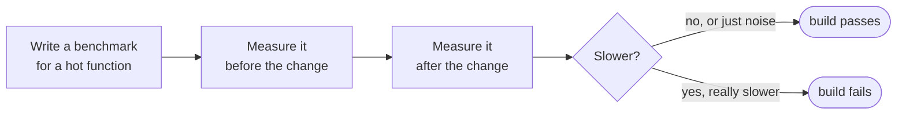
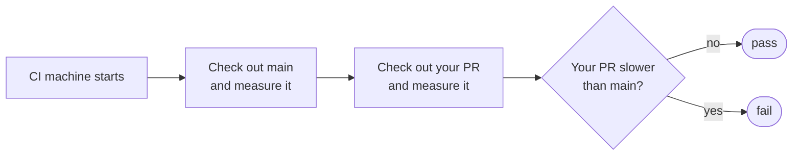

# benchguard

[](https://www.npmjs.com/package/benchguard)
[](https://nodejs.org)
[](package.json)
[](src/index.ts)
[](LICENSE)

### Your tests check if the code is *correct*. Nothing checks if it's still *fast*.

Here's a real two line change. It deletes a line and honestly looks cleaner:

```diff
- const byId = new Map(customers.map(c => [c.id, c]));
- const customer = byId.get(order.customerId);
+ const customer = customers.find(c => c.id === order.customerId);
```

Every test passes. The output is byte for byte identical. TypeScript is happy,
the linter is happy, your reviewer hits Approve.

It's also **31x slower.**

The first version puts customers in a Map, so each lookup is instant. The second
one re-scans the entire customer list for every single order. With 5,000 orders
and 1,000 customers that's 5 million comparisons on every request. Your laptop
won't notice with test data. Production will.

Nothing in a normal CI pipeline catches this. benchguard does:

```
name                                     baseline      current       delta      status
--------------------------------------------------------------------------------------
enrichOrders (5k orders x 1k customers)  198.38 µs     6.23 ms       +3042.8%   ✗ SLOWER

✗ 1 regression(s) over 15% threshold
```

Build goes red. Same as a failing test. You find out in the PR, not from a
3am alert three weeks later.

## The idea in one line

You already write tests like *"does `placeOrder()` return the right total?"*
That's a yes or no question about correctness.

benchguard answers a different question: *"is `placeOrder()` still as fast as
before my change?"* It's measured in real microseconds, not guesswork.

It times your code before a change and after it. If the change made it
meaningfully slower, the build fails.



Think of the recorded number like a snapshot test. A snapshot test saves what
your output *looked* like. This saves how fast it *ran*.

## Install

```bash
npm install --save-dev benchguard
```

No dependencies. TypeScript types included. Works on Node 18+, Bun and Deno.

## Getting started

**Step 1.** Write a benchmark file. It's a normal script, not a special test
format. Pick a function that runs a lot, feed it realistic data, and call `run()`.

```ts
// bench/orders.bench.ts
import { bench, run } from "benchguard";
import { enrichOrders } from "../src/orders.js";

// Use production-sized data. An O(n²) bug is invisible with 10 rows.
const customers = makeCustomers(1000);
const orders = makeOrders(5000);

bench("enrichOrders", () => enrichOrders(orders, customers));

await run({ threshold: 0.15 }); // fail if it gets 15% slower
```

**Step 2.** Record how fast it is right now.

```bash
node bench/orders.bench.ts --update
```

```
measuring enrichOrders ... 198.38 µs/op  ±2.5%
Baseline written to benchguard.baseline.json (1 benchmarks)
```

**Step 3.** Change some code, then run it again without the flag. It compares
against what you just recorded.

```bash
node bench/orders.bench.ts
```

It exits with code 1 if the code got slower, so any CI provider fails the job on
its own. No plugin, no reporter, no config file.

Yes, that's plain `node` running a `.ts` file. Node 22.18+ runs TypeScript
directly, no build step. On an older Node, use `npx tsx bench/orders.bench.ts`
instead. Plain JavaScript files work on any version.

Async functions work too. Return a promise and each run gets awaited.

## Why it won't spam you with false alarms

This is the part that decides whether a tool like this is useful or annoying.

Timing code is noisy. Run the exact same function twice and you get two slightly
different numbers, because your CPU changes clock speed, the garbage collector
fires, some other process wakes up. If a tool failed your build every time a
number wobbled by 4%, you'd mute it within a week and it would be worthless.

So benchguard asks **two** questions before it fails anything, not one:

1. Is it slower than the threshold you set? (default 10%)
2. Is the slowdown bigger than the wobble it just measured?

Both have to be yes.


A 3% slowdown on a machine that wobbles 4% is not a regression, it's static, and
benchguard stays quiet about it. A 3042% slowdown clears both bars instantly.

Under the hood it takes hundreds of samples and reports the **median** instead of
the average, so one unlucky garbage collection pause can't skew the result. It
also warms up the CPU before the first measurement, because code always runs
slower on a cold start and that alone can look like a fake regression.

## It tells you when your benchmark is lying

A false alarm is annoying. A benchmark that silently measures nothing is worse,
because it prints a confident green "ok" forever while production gets slower.

That happens more than you'd think. Say you write this:

```ts
bench("does nothing useful", () => 1 + 1);
```

The JavaScript engine is smart. It notices the result is never used and can skip
the work entirely, so you end up timing an empty loop. benchguard catches it:

```
measuring does nothing useful ... 0.8 ns/op  ±1.2%
    ! 0.77ns per op is suspiciously close to zero: the body may have been
      optimized away. Make the benchmark return a value that depends on the work.
```

It checks every measurement and warns you when:

- **the numbers are too noisy** to see a real regression (wobble over 10%)
- **too few samples** came back to trust the median
- **the time is near zero**, which usually means the work got optimized away
- **the function is too fast to time** on its own, so you should benchmark a
  bigger piece of work

Warnings never fail your build. They just tell you when the green checkmark
isn't earned.

One thing benchguard does for you automatically: it holds on to whatever your
function returns, so the engine can't decide your result is unused and delete
the call. That protects real work. It can't invent work that isn't there, though,
which is why `1 + 1` still gets flagged. The fix is always the same: benchmark
something real and return its result.

## Running it in CI (the right way)

Here's a trap. You record a baseline on your laptop, commit it, and CI compares
against it. But CI runs on a completely different computer. Different CPU,
different speed, other jobs running beside yours. Your laptop said 198 µs, the CI
machine says 217 µs, and nothing in your code changed. You're comparing two
computers, not two versions of your code.

The fix is simple: **don't compare against a number from somewhere else. Measure
both versions on the same machine, one right after the other.**



Same CPU, same minute, same everything. The only thing that changed between the
two numbers is your code, which is exactly what you want to measure.

Copy this into `.github/workflows/perf.yml`:

```yaml
name: perf
on: [pull_request]

jobs:
  bench:
    runs-on: ubuntu-latest
    steps:
      - uses: actions/checkout@v4
        with:
          fetch-depth: 0 # we need main's history too

      - uses: actions/setup-node@v4
        with:
          node-version: 22

      - name: Measure main
        run: |
          git checkout --detach ${{ github.event.pull_request.base.sha }}
          npm ci
          node bench/orders.bench.ts --update --baseline "$RUNNER_TEMP/baseline.json"

      - name: Measure this PR and compare
        run: |
          git checkout --detach ${{ github.event.pull_request.head.sha }}
          npm ci
          node bench/orders.bench.ts --baseline "$RUNNER_TEMP/baseline.json" --threshold 0.25
```

A few details that matter:

- `--baseline "$RUNNER_TEMP/baseline.json"` saves the number **outside** your
  project folder. That way switching branches with `git checkout` can't overwrite
  it.
- `--baseline` and `--threshold` override whatever is written in your bench file,
  so the same file works on your laptop and in CI without editing it.
- `--threshold 0.25` is deliberately relaxed. Shared CI machines are noisy, and
  the regressions worth catching are 30x, not 3%. A guard that never cries wolf
  is a guard your team keeps turned on.
- Nothing to commit. No baseline file goes stale in your repo.

This repo runs exactly this workflow on itself. See
[`.github/workflows/perf.yml`](.github/workflows/perf.yml).

### Or keep it simple and commit a baseline

If you don't use CI, or you're benchmarking on the same machine every time,
committing the baseline file is fine. Record once with `--update`, commit
`benchguard.baseline.json`, and run without the flag after that. When a change is
*supposed* to affect speed, re-record and commit it, like updating a snapshot.

## Things you should know

Benchmarks have some wobble that no trick fully removes, so a little care pays off:

- **Never compare numbers from two different machines.** Use the CI recipe above,
  which measures both versions on one machine. A laptop number against a CI
  number will send you chasing ghosts.
- **Pick a threshold that fits where it runs.** 10% is fine on a quiet machine.
  Shared CI runners are noisier, so 20% to 25% is more realistic. Set it loose
  enough that it never fake-fails you, since the regressions worth catching are
  usually huge, not 3%.
- **Benchmark with realistic data sizes.** The example above only shows a problem
  because it uses 5,000 orders. At 10 orders, the slow version looks fine.
- **Read the warnings.** If benchguard says a result is noisy or near zero, the
  green checkmark on that benchmark means nothing yet. Fix the benchmark first.

## A full working example

The repo has the complete story you saw at the top, ready to run:

- [`example/realworld/enrichOrders.ts`](example/realworld/enrichOrders.ts) is the
  service function, the kind of thing a `GET /orders` handler calls.
- [`example/realworld/enrichOrders.bench.ts`](example/realworld/enrichOrders.bench.ts)
  is the guard around it.

```bash
git clone https://github.com/shahzainshafique/benchguard
cd benchguard && npm install
npm run demo
```

Then go swap the `Map` lookup in `enrichOrders.ts` for `customers.find(...)` and
run it again. Watch it catch you.

## API

```ts
bench(name: string, fn: () => unknown | Promise<unknown>): void
run(opts?: RunOptions): Promise<Comparison[] | undefined>

// if you just want the numbers and no baseline machinery:
measure(fn, opts?): Promise<Stats>
trustWarnings(stats): string[]   // same checks run() prints, as a list
```

**Command line flags**

These work on any bench file and override what's written inside it.

| flag              | env var                | what it does                          |
| ----------------- | ---------------------- | ------------------------------------- |
| `--update`        |                        | record a new baseline instead of checking |
| `--baseline path` | `BENCHGUARD_BASELINE`  | where to read or write the baseline   |
| `--threshold n`   | `BENCHGUARD_THRESHOLD` | how much slower before it fails, e.g. `0.25` |

A flag beats an env var, and an env var beats the value in your file. A
threshold that isn't a real number stops the run with an error instead of
quietly letting everything pass.

**`RunOptions`** (set inside your bench file)

| option           | default                    | what it does                             |
| ---------------- | -------------------------- | ---------------------------------------- |
| `threshold`      | `0.1`                      | how much slower before it fails          |
| `baseline`       | `benchguard.baseline.json` | where the recorded number lives          |
| `update`         | `--update` in argv         | record a new baseline instead of checking |
| `timeBudgetMs`   | `500`                      | how long to sample each benchmark        |
| `globalWarmupMs` | `300`                      | CPU warm up before the first measurement |
| `minSamples`     | `10`                       | fewest samples to collect                |

## License

MIT © [Shahzain Shafique](https://github.com/shahzainshafique)
