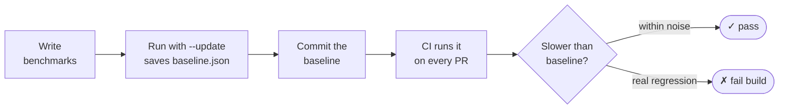
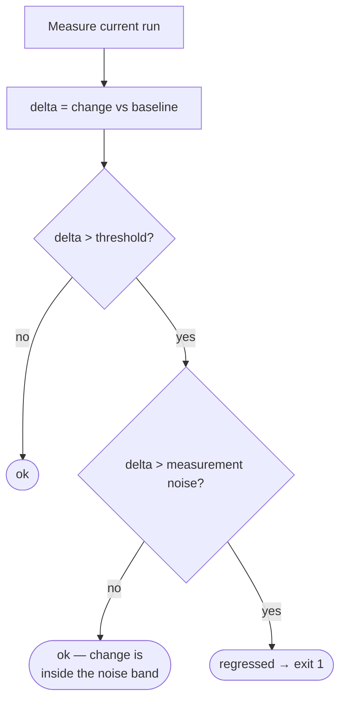

# benchguard

[](https://www.npmjs.com/package/benchguard)
[](https://nodejs.org)
[](package.json)
[](src/index.ts)
[](LICENSE)

Performance regressions don't announce themselves. A refactor lands, the tests
stay green, the PR merges. Three weeks later someone notices a hot path got 40%
slower — and now you're bisecting two hundred commits to find where.

**benchguard turns "wait, is this slower?" into a check that fails like any
broken test.** You record a baseline once, commit it, and every run after that
compares against it. If your code got slower, the build goes red.

The catch with benchmarking is noise: run the same code twice and you'll get
two different numbers. A guard that flags that noise as a regression gets muted
by Tuesday. benchguard's whole job is to fail **only** when a slowdown is real —
bigger than your threshold *and* bigger than the measurement noise.

```
name             baseline      current       delta      status
--------------------------------------------------------------
parseConfig      131.20 µs     405.53 µs     +209.1%    ✗ SLOWER
serialize        125.37 µs     124.10 µs     -1.0%      ok
tokenize          98.08 µs      96.40 µs     -1.7%      ok

✗ 1 regression(s) over 10% threshold      → exit 1, CI fails
```

## Install

```bash
npm install --save-dev benchguard
```

Zero dependencies. Ships with TypeScript types. Works on Node 18+, and in Deno
and Bun.

## How it fits together



Think of the baseline like a test snapshot: you commit it, it guards every PR,
and you update it on purpose when a change is *meant* to move performance.

## Quick start

A benchmark file is just a script you run — no config, no test runner, no CLI to
learn. Register benchmarks with `bench()`, then call `run()`.

**TypeScript** (`bench/sort.bench.ts`, run with [`tsx`](https://tsx.is)):

```ts
import { bench, run } from "benchguard";

const data = Array.from({ length: 1000 }, () => Math.random());

bench("spread + sort", () => [...data].sort((a, b) => a - b));
bench("slice + sort", () => data.slice().sort((a, b) => a - b));

await run({ threshold: 0.1 }); // fail if >10% slower than baseline
```

**Plain JavaScript** — same thing, no build step (`bench/sort.bench.mjs`):

```js
import { bench, run } from "benchguard";

bench("regex match", () => /\d{3}-\d{4}/.test("555-1234"));

await run();
```

Then, two commands — one to lock in the baseline, one to check against it:

```bash
node bench/sort.bench.mjs --update   # 1. record baseline (commit this file)
node bench/sort.bench.mjs            # 2. compare — exits 1 if slower
```

Async benchmarks just work — return a promise and it's awaited each iteration.

## Wire it into CI

The compare command exits non-zero on a regression, so any CI provider fails the
job automatically. No plugin, no reporter.

```yaml
# .github/workflows/perf.yml
name: perf
on: [pull_request]
jobs:
  bench:
    runs-on: ubuntu-latest
    steps:
      - uses: actions/checkout@v4
      - uses: actions/setup-node@v4
        with: { node-version: 20 }
      - run: npm ci
      - run: npx tsx bench/sort.bench.ts   # non-zero exit fails the PR
```

## Why it doesn't flake

Most of the code exists to earn one thing: your trust that a red build means a
real slowdown. Four things get you there.



- **Median, not mean** — one GC pause or a scheduler hiccup won't move the number
  it reports.
- **Auto-calibrated batches** — each timed batch runs long enough (≥1 ms) that
  timer resolution stops mattering.
- **Warm-up spin** — the CPU is ramped to a steady clock before the first
  measurement, so a cold start doesn't masquerade as a regression between
  `--update` and compare.
- **Noise-aware gate** — the diagram above. A slowdown has to clear both your
  threshold and the combined margin of error of the two runs before it's called
  a regression.

## The honest part

Microbenchmarks carry run-to-run variance that no in-process trick fully
removes — CPU turbo, thermal throttling, a noisy CI neighbour. So:

- **Record the baseline on the same kind of machine you compare on.** A baseline
  from your laptop measured against a CI runner is comparing two different
  worlds.
- **Tune `threshold` to your environment.** 10% suits a quiet machine; shared CI
  may want 15–20%.
- benchguard measures within a single process. Defeating steady-state drift
  entirely means running each benchmark in its own process and aggregating —
  that's on the roadmap, not here yet.

## API

```ts
bench(name: string, fn: () => unknown | Promise<unknown>): void
run(opts?: RunOptions): Promise<Comparison[] | undefined>

// lower-level, if you want the numbers without the baseline machinery:
measure(fn, opts?): Promise<Stats>
computeStats(perOp: number[], batch: number): Stats
compareOne(name, baseline, current, threshold): Comparison
```

**`RunOptions`**

| option           | default                     | what it does                                  |
| ---------------- | --------------------------- | --------------------------------------------- |
| `threshold`      | `0.1`                       | fail when this much slower (fraction)         |
| `baseline`       | `benchguard.baseline.json`  | path to the baseline file                     |
| `update`         | `--update` in argv          | write the baseline instead of comparing       |
| `timeBudgetMs`   | `500`                       | sampling time per benchmark                   |
| `globalWarmupMs` | `300`                       | CPU warm-up spin before the first measurement |
| `minSamples`     | `10`                        | minimum sample batches collected              |

## License

MIT © [Shahzain Shafique](https://github.com/shahzainshafique)
