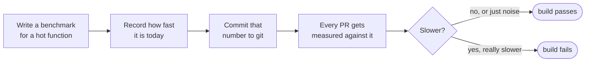
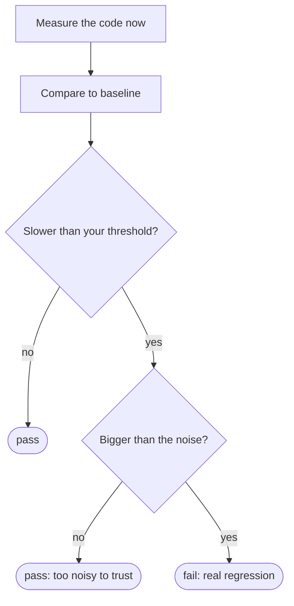

# benchguard

[](https://www.npmjs.com/package/benchguard)
[](https://nodejs.org)
[](package.json)
[](src/index.ts)
[](LICENSE)

### Your tests check if the code is *correct*. Nothing checks if it's still *fast*.

Here's a real two line change. It deletes a line and honestly looks cleaner:

```diff
- const byId = new Map(customers.map(c => [c.id, c]));
- const customer = byId.get(order.customerId);
+ const customer = customers.find(c => c.id === order.customerId);
```

Every test passes. The output is byte for byte identical. TypeScript is happy,
the linter is happy, your reviewer hits Approve.

It's also **31x slower.**

The first version puts customers in a Map, so each lookup is instant. The second
one re-scans the entire customer list for every single order. With 5,000 orders
and 1,000 customers that's 5 million comparisons on every request. Your laptop
won't notice with test data. Production will.

Nothing in a normal CI pipeline catches this. benchguard does:

```
name                                     baseline      current       delta      status
--------------------------------------------------------------------------------------
enrichOrders (5k orders x 1k customers)  198.38 µs     6.23 ms       +3042.8%   ✗ SLOWER

✗ 1 regression(s) over 15% threshold
```

Build goes red. Same as a failing test. You find out in the PR, not from a
3am alert three weeks later.

## The idea in one line

You already write tests like *"does `placeOrder()` return the right total?"*
That's a yes or no question about correctness.

benchguard answers a different question: *"is `placeOrder()` still as fast as it
was last week?"* It's measured in real microseconds, not guesswork.

You record how fast your code is today and commit that number. After that, every
PR gets measured against it. If someone makes it meaningfully slower, the build
fails.



Think of the recorded number like a snapshot test. A snapshot test saves what
your output *looked* like. This saves how fast it *ran*.

## Install

```bash
npm install --save-dev benchguard
```

No dependencies. TypeScript types included. Works on Node 18+, Bun and Deno.

## Getting started

**Step 1.** Write a benchmark file. It's a normal script, not a special test
format. Pick a function that runs a lot, feed it realistic data, and call `run()`.

```ts
// bench/orders.bench.ts
import { bench, run } from "benchguard";
import { enrichOrders } from "../src/orders.js";

// Use production-sized data. An O(n²) bug is invisible with 10 rows.
const customers = makeCustomers(1000);
const orders = makeOrders(5000);

bench("enrichOrders", () => enrichOrders(orders, customers));

await run({ threshold: 0.15 }); // fail if it gets 15% slower
```

**Step 2.** Record the baseline once, and commit the file it writes.

```bash
npx tsx bench/orders.bench.ts --update
```

```
measuring enrichOrders ... 198.38 µs/op  ±2.5%
Baseline written to benchguard.baseline.json (1 benchmarks)
```

**Step 3.** Run it without the flag to check against that baseline. This is the
command CI runs.

```bash
npx tsx bench/orders.bench.ts
```

It exits with code 1 if the code got slower, so any CI provider fails the job on
its own. No plugin, no reporter, no config file.

Async functions work too. Return a promise and each run gets awaited.

## Why it won't spam you with false alarms

This is the part that decides whether a tool like this is useful or annoying.

Timing code is noisy. Run the exact same function twice and you get two slightly
different numbers, because your CPU changes clock speed, the garbage collector
fires, some other process wakes up. If a tool failed your build every time a
number wobbled by 4%, you'd mute it within a week and it would be worthless.

So benchguard asks **two** questions before it fails anything, not one:

1. Is it slower than the threshold you set? (default 10%)
2. Is the slowdown bigger than the wobble it just measured?

Both have to be yes.



A 3% slowdown on a machine that wobbles 4% is not a regression, it's static, and
benchguard stays quiet about it. A 3042% slowdown clears both bars instantly.

Under the hood it takes hundreds of samples and reports the **median** instead of
the average, so one unlucky garbage collection pause can't skew the result. It
also warms up the CPU before the first measurement, because code always runs
slower on a cold start and that alone can look like a fake regression.

## Running it in CI

```yaml
# .github/workflows/perf.yml
name: perf
on: [pull_request]
jobs:
  bench:
    runs-on: ubuntu-latest
    steps:
      - uses: actions/checkout@v4
      - uses: actions/setup-node@v4
        with: { node-version: 20 }
      - run: npm ci
      - run: npx tsx bench/orders.bench.ts
```

When a change is *supposed* to affect performance, update the baseline on purpose
and commit it, exactly like updating a snapshot:

```bash
npx tsx bench/orders.bench.ts --update
```

## Things you should know

Benchmarks have some wobble that no trick fully removes, so a little care pays off:

- **Record the baseline on the same kind of machine that checks it.** A number
  from your laptop compared against a CI runner is comparing two different
  computers, and you'll chase ghosts.
- **Pick a threshold that fits where it runs.** 10% is fine on a quiet machine.
  Shared CI runners are noisier, so 15% to 20% is more realistic. Set it loose
  enough that it never fake-fails you, since the regressions worth catching are
  usually huge, not 3%.
- **Benchmark with realistic data sizes.** The example above only shows a problem
  because it uses 5,000 orders. At 10 orders, the slow version looks fine.
- benchguard measures inside one process. Running each benchmark in a separate
  process would remove even more variance, and that's planned, but it isn't here
  yet.

## A full working example

The repo has the complete story you saw at the top, ready to run:

- [`example/realworld/enrichOrders.ts`](example/realworld/enrichOrders.ts) is the
  service function, the kind of thing a `GET /orders` handler calls.
- [`example/realworld/enrichOrders.bench.ts`](example/realworld/enrichOrders.bench.ts)
  is the guard around it.

```bash
git clone https://github.com/shahzainshafique/benchguard
cd benchguard && npm install
npm run demo
```

Then go swap the `Map` lookup in `enrichOrders.ts` for `customers.find(...)` and
run it again. Watch it catch you.

## API

```ts
bench(name: string, fn: () => unknown | Promise<unknown>): void
run(opts?: RunOptions): Promise<Comparison[] | undefined>

// if you just want the numbers and no baseline machinery:
measure(fn, opts?): Promise<Stats>
```

**`RunOptions`**

| option           | default                    | what it does                             |
| ---------------- | -------------------------- | ---------------------------------------- |
| `threshold`      | `0.1`                      | how much slower before it fails          |
| `baseline`       | `benchguard.baseline.json` | where the recorded number lives          |
| `update`         | `--update` in argv         | record a new baseline instead of checking |
| `timeBudgetMs`   | `500`                      | how long to sample each benchmark        |
| `globalWarmupMs` | `300`                      | CPU warm up before the first measurement |
| `minSamples`     | `10`                       | fewest samples to collect                |

## License

MIT © [Shahzain Shafique](https://github.com/shahzainshafique)
